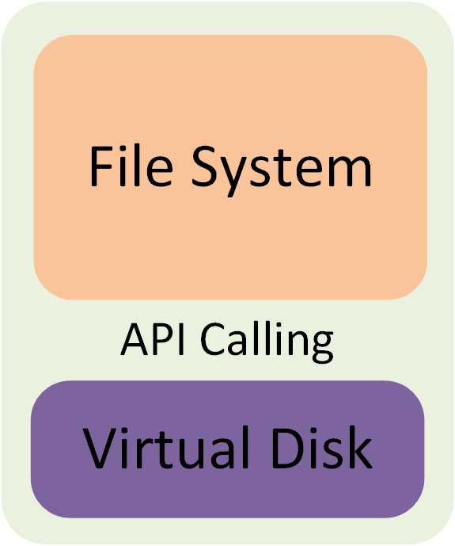

# Virtual_File_System

课程项目，参考`FAT32`设计的虚拟文件系统。

## System Design

	

代码分为文件系统和虚拟磁盘两个部分。在文件系统中，所有函数不直接操作虚拟磁盘`block vdisk[1000]`中的数据（尽管虚拟磁盘`vdisk`在内存中，而且是全局变量，这些函数是可以直接访问到`vdisk`中的数据的）,而是通过调用`visual disk`模块提供的API进行控制操作和IO操作(`saveblock()`和`loadblock()`)。事实上，`file system`并不知道磁盘是虚拟的，假设我们要使用真实的磁盘硬件来运行我们的文件系统，也只需要该硬件的驱动实现了相同功能的API供我们的文件系统调用即可，而几乎不需要改动我们的文件系统的代码。

	

读数据流程举例：文件系统调用`loadblock(id)`将数据读到`buffer`，然后将数据从`buffer`取出放入`malloc`的一块内存块中，该数据块即为磁盘中的一块数据在逻辑内存中的复制，CPU可以读写这些数据块。为了确定数据块的位置，在`useropen`中加入了一个指针数组`block *mem[1000]`，初始值均为`Null`，读入一个数据块后对应指针指向该数据块，关闭文件时`free`所有该文件在内存的数据块，若文件已更改，需要将数据块写回`vdisk`。一般打开一个文件时，不读入该文件在磁盘的所有数据块，只读入第一个块，后续都是按需读取，例如现在需要使用第`j`块数据，检查`mem[j]`，非`Null`则可直接使用在内存的数据块，如果是`NULL`则需要进行磁盘io（即调用`loadblock(id)`）

## Other Feature

+ 目录项的管理：一个目录文件中存放的信息为该文件夹下文件的`FCB`（所谓的目录项），在本系统中`FCB`大小为64B,也就是说一个目录文件的磁盘块能放16个`FCB`。目录文件自身的FCB中的`length`，是目录文件中包含目录项的大小，也就是目录项个数×64B，而不是整个文件夹的大小。因为一个文件夹初始时目录项就有 `.`和`..`，因此一个文件夹的`length`最小为128B.当需要删除或新建一个文件夹下子文件夹或文件时，也就是要删除或添加目录项时，通常来说`length`会发生变化。但是在本文件系统中采用Lazy的管理方式，若只是删除中间的一个目录项，则只是将该目录项的`free`置为0，而不更新`length`。在新建目录项时，查找目录文件中的空表项（即`free`值为0的表项），查找范围为前`length/64`个，若找到，则使用该空目录项，`length`无需改变；如果没找到，则申请一个新的表项，`length+=sizeof(FCB)`。此外，在删除一个目录项时判断该目录项是不是目录文件中最后一个目录项（第`length/64`个），如果是，则从此表项开始往回检查，每遇到一个空表项，`length-=sizeof(FCB)`，同时，每遍历完一个磁盘块，说明该磁盘块中已经不存在有效数据，需要在`fat`中回收该磁盘块完；重复上述过程直到遇到非空表项，退出循环。

+ `Openfilelist`的管理：为了支持递归式打开文件（如`cd ../s/x`）和回溯式关闭文件。我们采用了一个类似fat表的数据结构`int openmanage[10]`，该数组`openmanage[fd]`记录了前一级打开文件的`fd`,函数`chainopen()`在逐级打开文件时会记录这一信息，函数`chainclose()`在逐级关闭文件时依据这一信息进行回溯。`openmanage`与fat的不同之处在于前者每一个元素记录的是前一个元素的下标，而fat记录后一个元素的下标，之所以`openmanage`记录前一个元素，是因为这种方式更适合记录树形的打开结构，多个`fd`可能有共同的上级`fd`。我们之所以要使用`openmanage`这一数据结构而不是直接通过链式路径中的文件名来逐级关闭文件是因为如果路径是 `../../x`，单纯使用文件名遍历`openfilelist`会出现问题；同时在`openfilelist`允许的最大数量很大时，我们的方法效率更高。
